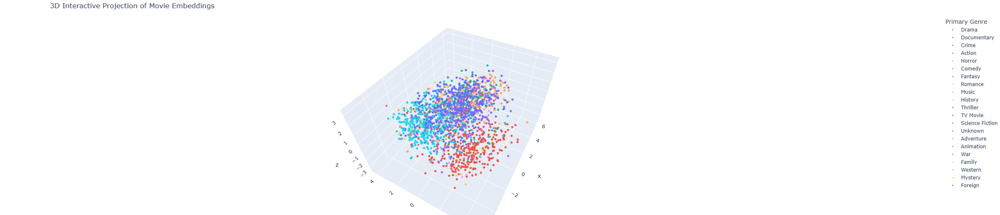
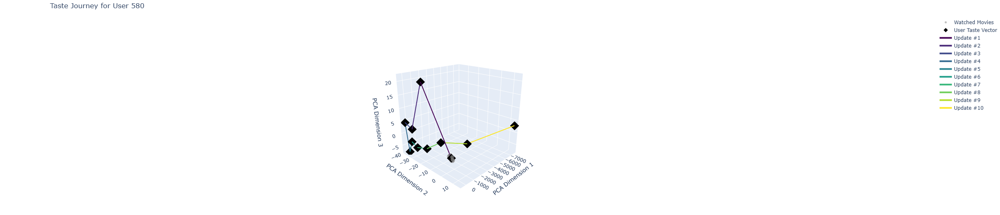

# Dynamic Multimodal Embedding Based Recommendation System

This repository contains the complete research prototype for a dynamic, multimodal recommendation system built with PyTorch. The system learns rich embeddings for movies by fusing text and image data and models user preferences dynamically to provide accurate and diverse recommendations.

---

## 🌟 Key Features

- **Multimodal Content Embeddings:** Fuses text (plot, genres, cast/crew) and image (movie posters) data into a single, powerful vector representation for each movie using pre-trained models like CLIP and Sentence-BERT.
- **Multi-Task Learning:** The content embedding model is trained using a combined triplet loss on genre, director, and actor similarity, forcing it to learn a holistic understanding of movies.
- **Dynamic User Profiles:** A lightweight Feed-Forward Network (FFN) with a residual connection updates user embeddings based on their watch history, capturing evolving tastes.
- **Two-Tower Ranking Model:** An efficient Two-Tower architecture learns a shared matching space for users and items, optimized for high-quality ranking.
- **Fast Candidate Retrieval:** Uses **FAISS** (Facebook AI Similarity Search) for blazingly fast retrieval of candidate movies from the entire catalog.
- **Diversity-Aware Re-ranking:** Implements **Maximum Marginal Relevance (MMR)** to re-rank candidates, ensuring the final recommendation list is both relevant and diverse.
- **Interactive Visualizations:** Includes 3D interactive plots (using Plotly) to explore the learned embedding spaces for both movies and user journeys.

---

## 🏗️ System Architecture

The project follows a modular, multi-phase pipeline:

```
[Raw Data] -> [1. Content Embedding] -> [2. User Embedding] -> [3. Ranking & Re-ranking] -> [Final Recommendations]
                  |                         |                          |
              (Multi-Task MLP)             (FFN)       (Two-Tower + FAISS + MMR)
```

---

## 🚀 Getting Started

Follow these steps to set up the environment and run the project.

### 1. Setup and Installation

First, clone the repository to your local machine:

```bash
git clone https://github.com/your-username/your-repo-name.git
cd your-repo-name
```

It is highly recommended to create a Python virtual environment:

```bash
python -m venv venv
source venv/bin/activate  # On Windows, use `venv\Scripts\activate`
```

Install all the necessary dependencies using the `requirements.txt` file:

```bash
pip install -r requirements.txt
```

### 2. Data Setup

The raw datasets for this project are not stored in the repository. Please see the detailed instructions in the **`data/raw/README.md`** file to download the necessary files from Kaggle.

### 3. Running the Notebooks

The project is broken down into a series of Jupyter/Colab notebooks. Please run them in the following order to reproduce the results:

1. **`notebooks/1_Content_Embedding_Generation.ipynb`**  
   Loads raw movie data, trains the multi-task fusion MLP, and generates the final content embeddings for all movies.

2. **`notebooks/2_User_Embedding_Generation.ipynb`**  
   Processes the raw ratings data to create user interaction sequences, trains the dynamic FFN model, and generates the final taste vector for every user.

3. **`notebooks/3_Ranking_and_Evaluation.ipynb`**  
   Trains the final Two-Tower ranking model and runs a complete evaluation with metrics like NDCG, Precision, Recall, ILD, and Coverage.

4. **`notebooks/4_Visualizations.ipynb`**  
   Generates 3D interactive plots for exploring movie embeddings and visualizing user taste evolution.

---

## 📈 Key Results & Visualizations

The system was evaluated on its ability to provide relevant and diverse recommendations. The multi-task Two-Tower model with MMR re-ranking (`lambda = 0.5`) achieved a strong balance between accuracy and diversity.

### Final Evaluation Metrics (`lambda = 0.5`)

| Metric                   | Score  |
|--------------------------|--------|
| Precision@10             | 0.0141 |
| Recall@10                | 0.0706 |
| NDCG@10                  | 0.0476 |
| **Intra-List Diversity** | 0.0387 |
| **Catalog Coverage**     | 4.49%  |

### 3D Movie Embedding Space

This interactive plot shows the ~2000 movie embeddings projected into 3D space, colored by genre. Clear clusters for Action, Comedy, and Drama demonstrate the success of the content embedding model.

> 

### User Taste Journey

This plot shows the path of a single user's embedding vector as it is updated by the FFN after each new movie they watch, demonstrating the dynamic nature of the user profile.

> 

---

## 🛠️ Future Work

This prototype can be extended in several ways:

- **Adding More Modalities:** Incorporate audio embeddings from movie soundtracks or trailers.
- **Advanced Sequential Models:** Replace the FFN with a Transformer-based model (like SASRec) for more sophisticated sequence understanding.
- **Online A/B Testing:** Deploy the model and test its performance with real users to measure engagement metrics like click-through rate.


---

## 📞 Acknowledgments

- This project was developed by `Ujwal Jibhkate`.
- Special thanks to the creators of the datasets used and the open-source libraries that made this work possible.
